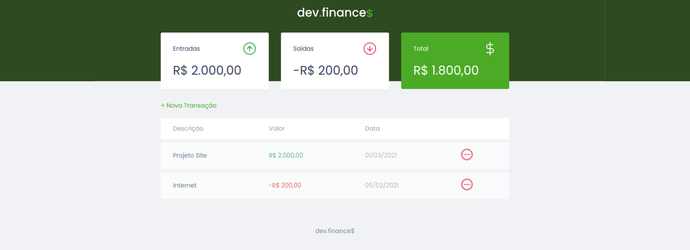

<<<<<<< HEAD
<h1 align="center">
    dev.finance$
</h1>
=======
# maratona_discover
Projeto desenvolvido através do evento Maratona Discover, promovido pela Rocketseat, sob a condução do professor Mayk Brito. 
Aplicação financeira que utiliza JavaScript, CSS, HTML.
>>>>>>> a064c2c742452c59410f3054e44be593cf37b42a

<div align=center>

<h3>

Projeto desenvolvido na #MaratonaDiscover da [Rocketseat], sob orientação do Professor Mayk Brito, utilizando **HTML**, **CSS** e **JAVASCRIPT**.

</h3>




</div>

<br>

## 📚 **Sobre**

O dev.finances é uma aplicação de gerenciamento de finanças, que permite o cadastro de entradas e saídas, bem como, realiza o cálculo do respectivo saldo.

<br>

### 📌  **Tecnologias utilizadas**
* HTML
* CSS
* JavaScript

<br>
<br>

### 🖥 **Ferramentas**

- **Protótipo:** **<kbd>[Figma](https://www.figma.com/file/QvsBEIf0QdKlPBdwzQXMsZ/dev.finance%24-Maratona-Discover-(Copy)?node-id=1%3A863)</kbd>** 
- **Editor:** **[Visual Studio Code](https://code.visualstudio.com/)** 
- **Commit Conventional:** **[Commitlint]**
- **Fontes:** **[Google Fonts - Poppins](https://fonts.google.com/specimen/Poppins?query=Poppins)**
- **Emojis:** **[Emojipedia](https://emojipedia.org/)** 

- **Anotações / Checklist:** **[Notion](https://www.notion.so/)**

<br>

### 🚀 **Mão na massa**

```bash
# Clone este repositório
$ git clone https://github.com/Joao-Augusto-Oliveira/dev.finance

# Acesse a pasta do projeto no terminal/cmd
$ cd dev.finance

```

<br>
<br>

<h3 align="center">
Feito com 💜 por <a href="https://www.linkedin.com/in/joão-augusto-oliveira-dos-santos-9b0693195">João Augusto</a>
<br><br>

  
</a>
</h3>

<!-- Links -->

[Rocketseat]: https://rocketseat.com.br/

[Commitlint]: https://github.com/conventional-changelog/commitlint

